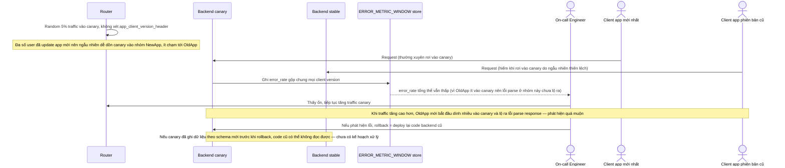

# Base sequence — Canary rollout & rollback (chưa nhận diện version app)

Đây là **base**, flow "Canary rollout" ở trạng thái hiện tại — traffic canary chọn ngẫu nhiên không phân biệt phiên bản app, metric lỗi gộp chung, rollback chỉ đơn giản là revert code. Flow này liên quan mật thiết tới enhance vì yêu cầu 2, 3, 4 và 5 của đề bài đều nhằm sửa đúng các lỗ hổng ở đây.

