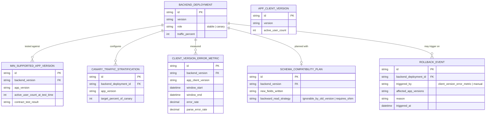

# Enhance ERD — sau khi canary nhận diện đa phiên bản app

Đây là ERD **sau khi** enhance được áp dụng lên base. So với base, có 4 nhóm entity mới, ứng trực tiếp với 5 yêu cầu trong đề bài:

- `MIN_SUPPORTED_APP_VERSION` (mới) — xác định rõ tập phiên bản app tối thiểu cần hỗ trợ dựa trên số liệu user thực tế, dùng làm căn cứ test hợp đồng thay vì chỉ test app mới nhất.
- `CANARY_TRAFFIC_STRATIFICATION` (mới) — đảm bảo traffic canary có đủ tỷ lệ app cũ lẫn mới, không dồn ngẫu nhiên như base.
- `CLIENT_VERSION_ERROR_METRIC` (mới) — tách error/parse-error rate theo từng phiên bản app, thay vì gộp chung.
- `SCHEMA_COMPATIBILITY_PLAN` + `ROLLBACK_EVENT` (mới) — rollback có kế hoạch đảm bảo dữ liệu ghi theo schema mới vẫn đọc được bởi code cũ.

