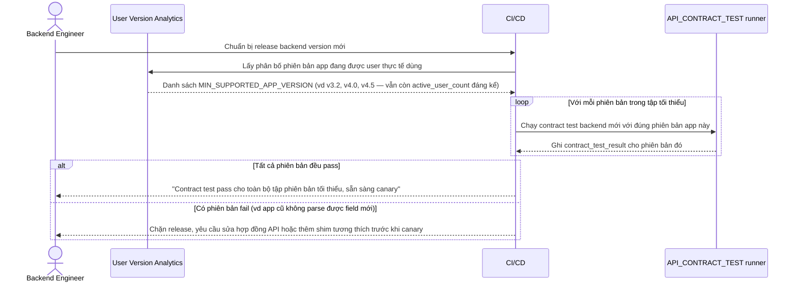

# Enhance sequence — Pre-release contract test (test đủ tập phiên bản tối thiểu)

Đây là **enhance**, cùng flow "Pre-release contract test" đã có ở base nhưng nay thay đổi theo yêu cầu thứ 1 của đề bài: xác định tập phiên bản app tối thiểu cần hỗ trợ dựa trên số liệu user thực tế, và test hợp đồng API với từng phiên bản đó.

