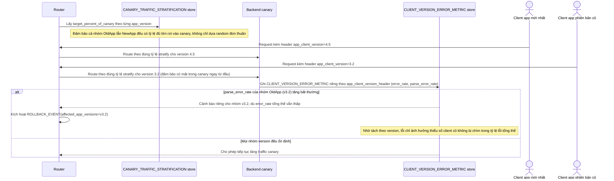

# Enhance sequence — Stratified canary traffic & per-version monitoring

Đây là **enhance**, cùng flow "Canary rollout" đã có ở base nhưng nay thay đổi theo yêu cầu 2, 3 và 4 của đề bài: traffic canary được stratify để bao gồm cả app cũ lẫn mới, và metric lỗi tách riêng theo `app_client_version_header` để phát hiện lỗi parse chỉ ảnh hưởng nhóm client cũ.

