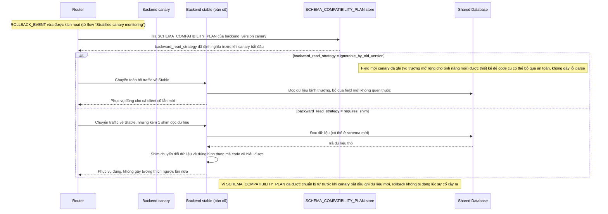

# Enhance sequence — Backward-compatible rollback

Đây là **enhance**, cùng flow "Rollback" đã có ở base nhưng nay thay đổi hoàn toàn theo yêu cầu thứ 5 của đề bài: nếu canary đã ghi dữ liệu theo schema mới, rollback phải đảm bảo phiên bản cũ (đang phục vụ client legacy) vẫn đọc được dữ liệu đó, không chỉ đơn giản revert code.

