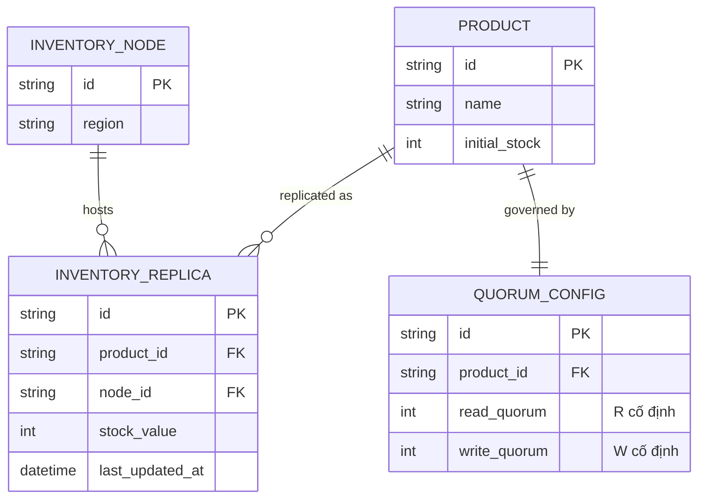

# Base ERD — Tồn kho phân tán trước khi có quorum thích ứng

Đây là **base**: mô hình dữ liệu suy luận từ ngữ cảnh đề bài, thể hiện trạng thái hệ thống **trước khi** có cấu hình quorum thích ứng theo giai đoạn. Đề bài nói tồn kho phân tán trên nhiều node với cấu hình quorum (W, R) — nên base cần đủ: sản phẩm, node giữ replica tồn kho, và 1 cấu hình quorum cố định duy nhất. Chưa có entity nào phục vụ chuyển đổi theo ngưỡng tồn kho/nhận diện partition/đối soát cuối sale/benchmark — những thứ đó là phần enhance.

