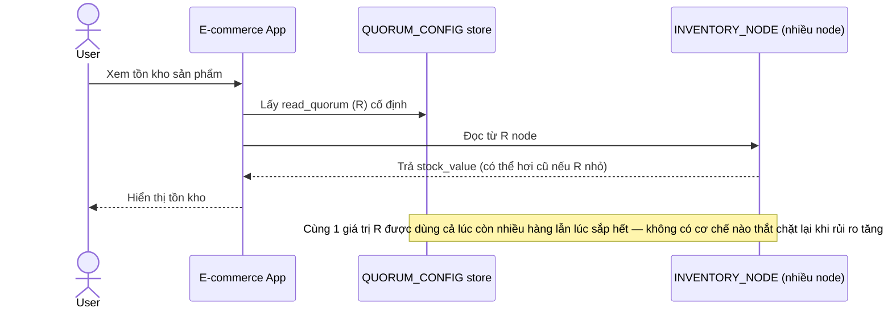

# Base sequence — Read stock (quorum cố định)

Đây là **base**, flow "Đọc tồn kho hiển thị cho user" — dùng cấu hình quorum cố định xuyên suốt, không phân biệt trước hay trong lúc gần hết hàng.

```mermaid
sequenceDiagram
    actor User
    participant App as E-commerce App
    participant Config as QUORUM_CONFIG store
    participant Nodes as INVENTORY_NODE (nhiều node)

    User->>App: Xem tồn kho sản phẩm
    App->>Config: Lấy read_quorum (R) cố định
    App->>Nodes: Đọc từ R node
    Nodes-->>App: Trả stock_value (có thể hơi cũ nếu R nhỏ)
    App-->>User: Hiển thị tồn kho
    Note over Config,Nodes: Cùng 1 giá trị R được dùng cả lúc còn nhiều hàng lẫn lúc sắp hết — không có cơ chế nào thắt chặt lại khi rủi ro tăng
```
