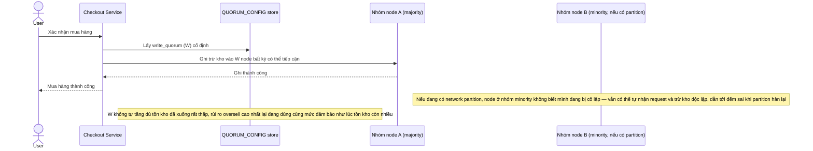

# Base sequence — Decrement stock (chưa nhận diện partition/ngưỡng nguy hiểm)

Đây là **base**, flow "Trừ tồn kho khi mua hàng" ở trạng thái hiện tại — dùng W cố định, không kiểm tra ngưỡng tồn kho nguy hiểm, không xử lý riêng khi có network partition. Flow này liên quan mật thiết tới enhance vì yêu cầu 2 và 3 của đề bài chính là sửa đúng các lỗ hổng ở đây.

