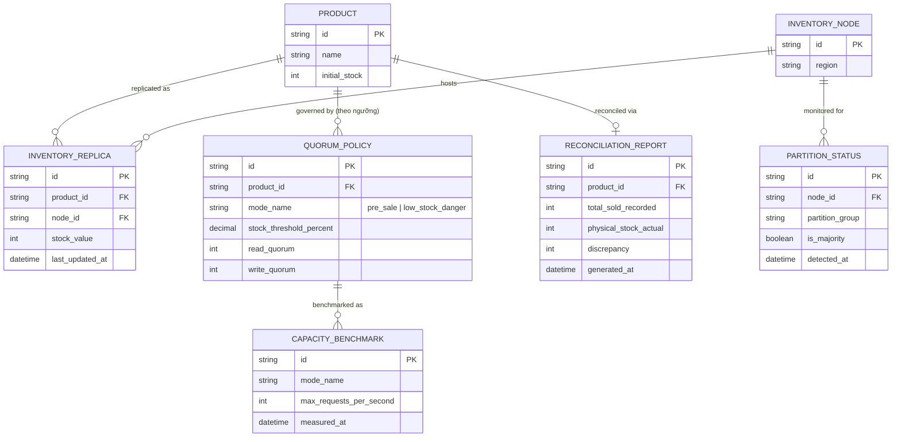

# Enhance ERD — sau khi có quorum thích ứng theo giai đoạn

Đây là ERD **sau khi** enhance được áp dụng lên base. So với base, có 4 nhóm entity mới, ứng trực tiếp với 5 yêu cầu trong đề bài:

- `QUORUM_POLICY` (mới) — nhiều mức cấu hình theo ngưỡng tồn kho (trước sale R thấp, gần hết hàng W cao), thay cho 1 `QUORUM_CONFIG` cố định như base.
- `PARTITION_STATUS` (mới) — nhận diện node nào thuộc nhóm minority khi có partition, để từ chối trừ kho ở đó.
- `RECONCILIATION_REPORT` (mới) — đối soát tổng bán ra ghi nhận với tồn kho vật lý thực tế cuối sale.
- `CAPACITY_BENCHMARK` (mới) — đo request/giây chịu được ở từng mode.

