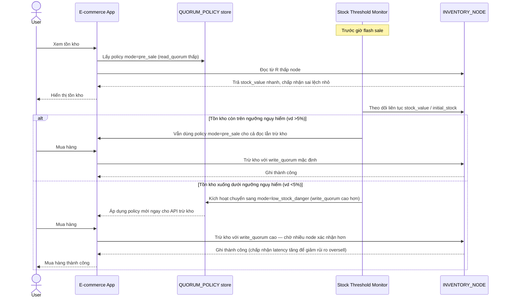

# Enhance sequence — Adaptive quorum switch (R thấp → W cao)

Đây là **enhance**, hợp nhất 2 flow "Read stock" và "Decrement stock" đã có ở base thành 1 luồng thích ứng, theo yêu cầu 1 và 2 của đề bài: dùng R thấp trước sale, tự chuyển sang W cao khi tồn kho xuống dưới ngưỡng nguy hiểm.

