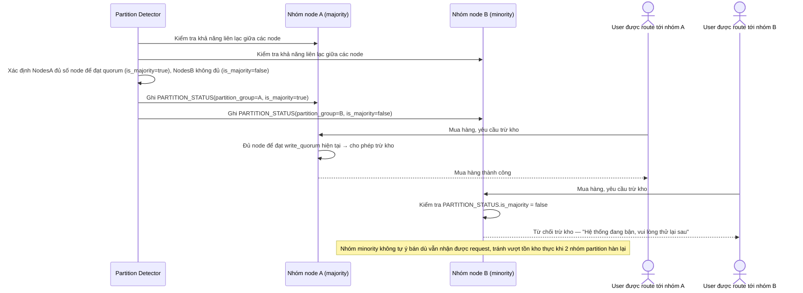

# Enhance sequence — Partition minority rejection

Đây là **enhance**, flow hoàn toàn mới, phát sinh từ enhance — chưa tồn tại ở base. Đáp ứng yêu cầu thứ 3 của đề bài: khi có network partition, nhóm minority phải từ chối trừ kho để tránh vượt tồn kho thực khi partition hàn lại.

