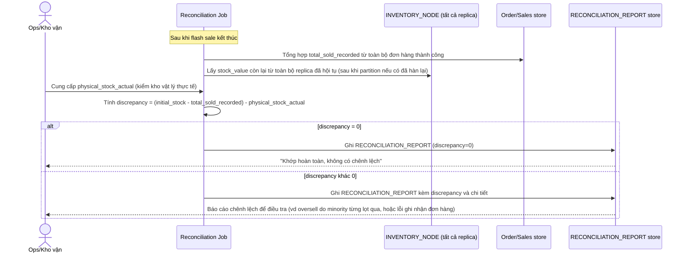

# Enhance sequence — Post-sale reconciliation

Đây là **enhance**, flow hoàn toàn mới, phát sinh từ enhance — chưa tồn tại ở base. Đáp ứng yêu cầu thứ 4 của đề bài: đối soát tổng số bán ra theo ghi nhận hệ thống với tồn kho vật lý thực tế, có báo cáo chênh lệch nếu có.

