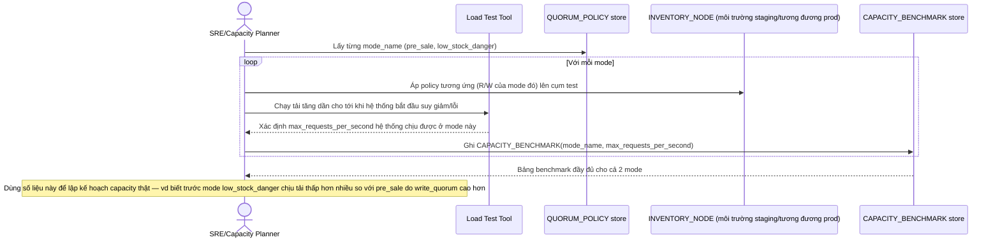

# Enhance sequence — Capacity benchmark per mode

Đây là **enhance**, flow hoàn toàn mới, phát sinh từ enhance — chưa tồn tại ở base. Đáp ứng yêu cầu thứ 5 của đề bài: benchmark rõ request/giây hệ thống chịu được ở từng mode quorum, phục vụ lập kế hoạch capacity trước khi flash sale diễn ra thật.

