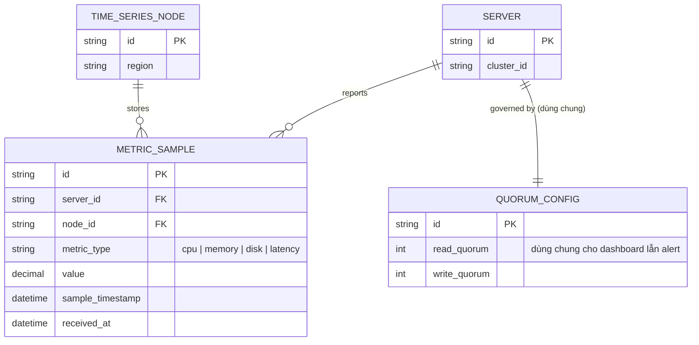

# Base ERD — Metrics giám sát trước khi tách quorum theo mục đích đọc

Đây là **base**: mô hình dữ liệu suy luận từ ngữ cảnh đề bài, thể hiện trạng thái hệ thống **trước khi** tách quorum riêng cho dashboard và alert. Đề bài nói dữ liệu metrics lưu trên cụm time-series phân tán, phục vụ cả dashboard lẫn cảnh báo — nên base cần đủ: server, mẫu metric, node lưu trữ, và 1 cấu hình quorum duy nhất dùng chung cho mọi mục đích đọc/ghi. Chưa có entity nào phục vụ policy theo mục đích/partition write policy/đánh giá backfill hồi tố/đo latency riêng từng luồng — những thứ đó là phần enhance.

