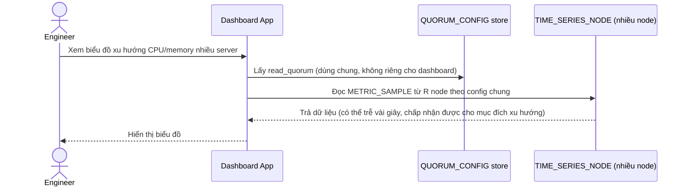

# Base sequence — Dashboard query

Đây là **base**, flow "Đọc dữ liệu cho dashboard tổng hợp" — dùng cùng 1 read_quorum như mọi luồng đọc khác, không phân biệt mục đích quan sát xu hướng hay cảnh báo khẩn cấp.

