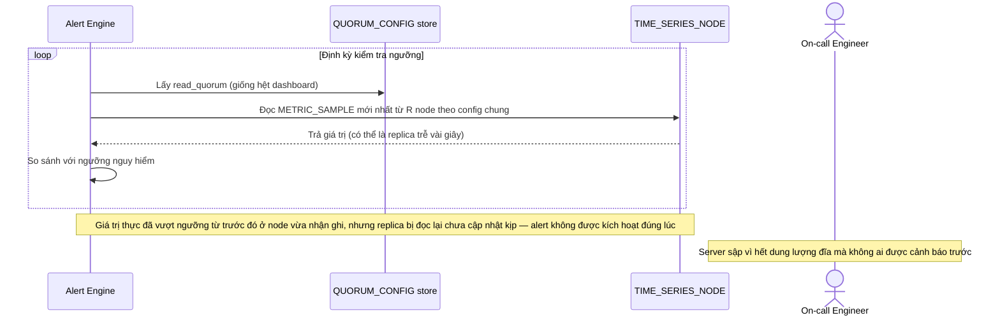

# Base sequence — Threshold alert check (dùng chung quorum với dashboard)

Đây là **base**, flow "Kiểm tra ngưỡng nguy hiểm để cảnh báo" ở trạng thái hiện tại — dùng cùng read_quorum với dashboard, có thể đọc phải replica trễ. Flow này liên quan mật thiết tới enhance vì yêu cầu thứ 2 của đề bài chính là sửa đúng lỗ hổng này.

