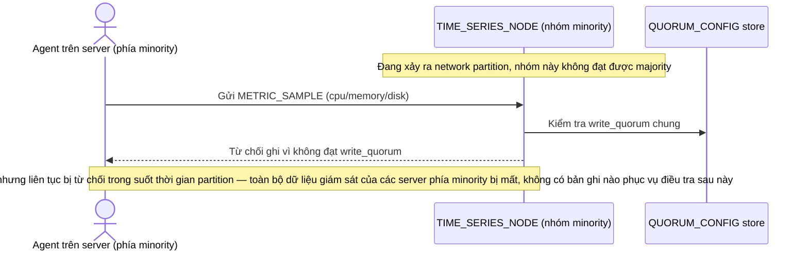

# Base sequence — Agent write during partition (minority bị từ chối, mất dữ liệu)

Đây là **base**, flow "Agent gửi metrics lúc network partition" ở trạng thái hiện tại — ghi luôn yêu cầu đạt write_quorum chung, nên phía minority bị từ chối hoàn toàn. Flow này liên quan mật thiết tới enhance vì yêu cầu thứ 3 của đề bài chính là quyết định lại cách xử lý ở đây.

