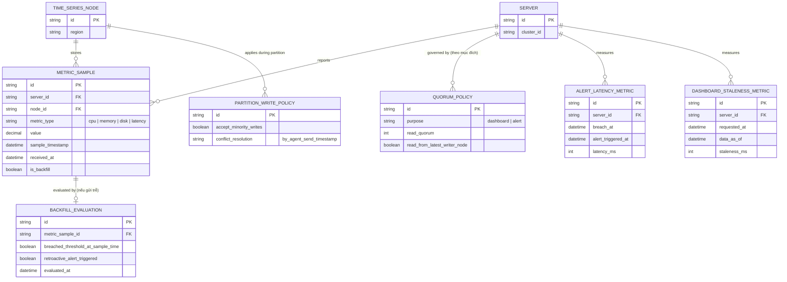

# Enhance ERD — sau khi tách quorum theo mục đích + xử lý partition/backfill

Đây là ERD **sau khi** enhance được áp dụng lên base. So với base, có 4 nhóm entity mới, ứng trực tiếp với 5 yêu cầu trong đề bài:

- `QUORUM_POLICY` (mới) — tách riêng cấu hình theo mục đích (`dashboard` dùng R thấp, `alert` dùng R cao/đọc node vừa ghi), thay cho 1 config chung như base.
- `PARTITION_WRITE_POLICY` (mới) — quyết định rõ chấp nhận ghi phía minority để ưu tiên availability, và cách merge khi partition hàn lại theo timestamp agent gửi.
- `BACKFILL_EVALUATION` (mới) — đánh giá lại ngưỡng cho dữ liệu gửi bù trễ, kích hoạt cảnh báo hồi tố nếu cần.
- `ALERT_LATENCY_METRIC` + `DASHBOARD_STALENESS_METRIC` (mới) — đo end-to-end alert latency và tỉ lệ stale, tách riêng theo từng luồng.

