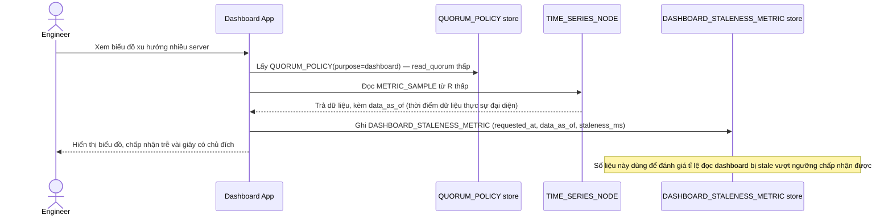

# Enhance sequence — Dashboard query (R thấp riêng, đo staleness)

Đây là **enhance**, cùng flow "Dashboard query" đã có ở base nhưng nay thay đổi theo yêu cầu 1 và 5 của đề bài: dùng `QUORUM_POLICY(purpose=dashboard)` với R thấp riêng, và đo `DASHBOARD_STALENESS_METRIC` để biết tỉ lệ đọc bị trễ.

