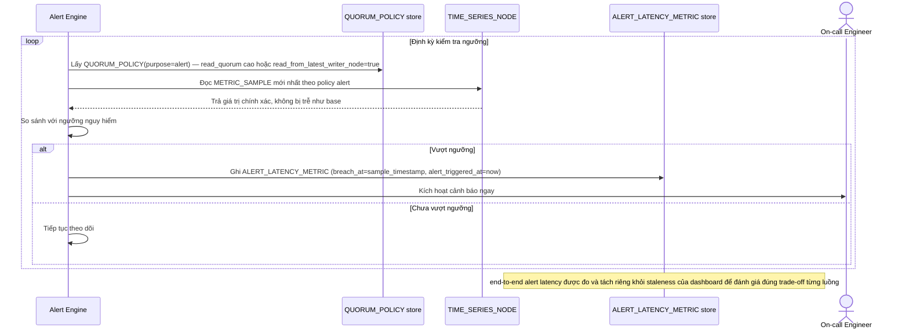

# Enhance sequence — Threshold alert check (R cao/đọc node vừa ghi, đo alert latency)

Đây là **enhance**, cùng flow "Threshold alert check" đã có ở base nhưng nay thay đổi theo yêu cầu 2 và 5 của đề bài: dùng `QUORUM_POLICY(purpose=alert)` với R cao hoặc đọc trực tiếp node vừa nhận ghi, và đo `ALERT_LATENCY_METRIC` end-to-end.

