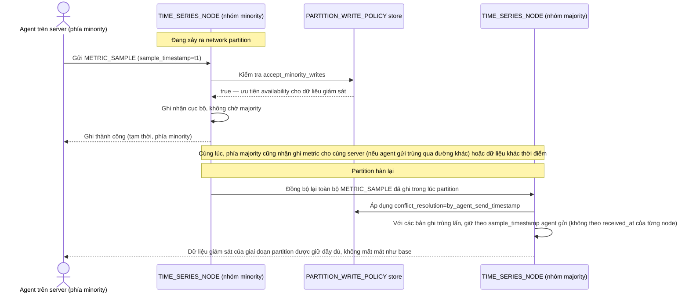

# Enhance sequence — Partition write accept & merge

Đây là **enhance**, cùng flow "Agent write during partition" đã có ở base nhưng nay thay đổi hoàn toàn theo yêu cầu thứ 3 của đề bài: ưu tiên availability — chấp nhận ghi phía minority, và merge theo timestamp agent gửi khi partition hàn lại thay vì từ chối như base.

