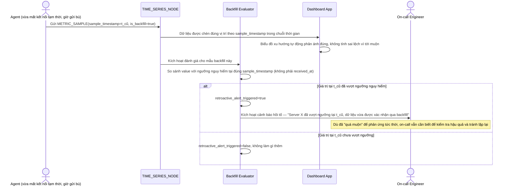

# Enhance sequence — Retroactive alert on backfill

Đây là **enhance**, flow hoàn toàn mới, phát sinh từ enhance — chưa tồn tại ở base (base không đánh giá lại dữ liệu gửi trễ). Đáp ứng yêu cầu thứ 4 của đề bài: dữ liệu backfill trễ vẫn phải được đánh giá lại theo ngưỡng tại đúng thời điểm xảy ra, kích hoạt cảnh báo hồi tố nếu cần thay vì bỏ qua vì "đã quá muộn".

