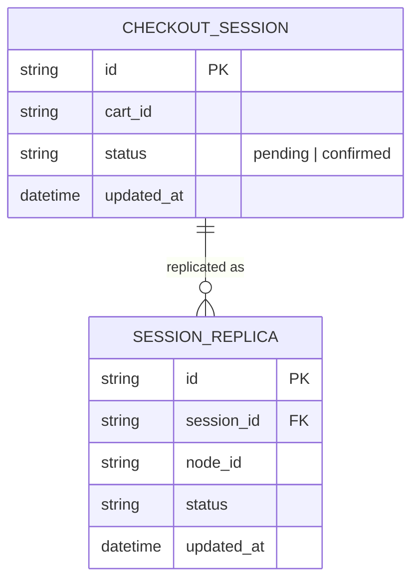

# Base ERD — Session store trước khi có tunable consistency

Đây là **base**: mô hình dữ liệu suy luận từ ngữ cảnh đề bài, thể hiện trạng thái hệ thống **trước khi** tách chế độ nhất quán theo từng API. Đề bài nói session/checkout state lưu trên store phân tán, đa số đọc nhanh — nên base cần đủ: session checkout và các replica của nó, dùng chung 1 chế độ eventual consistency cho mọi API kể cả xác nhận thanh toán. Chưa có entity nào phục vụ policy CP/AP riêng biệt/lock đơn hàng/cảnh báo staleness/tài liệu hoá guarantee — những thứ đó là phần enhance.

