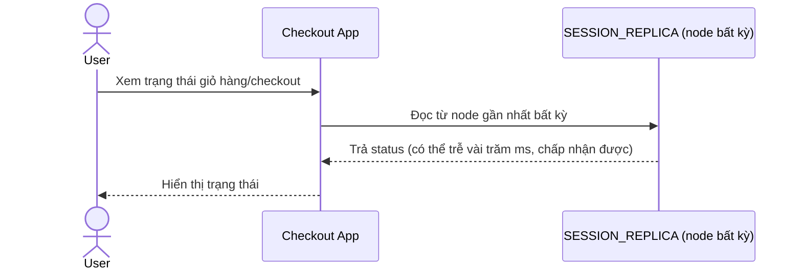

# Base sequence — Read session

Đây là **base**, flow "Đọc session/trạng thái checkout" — dùng eventual consistency, phù hợp cho phần lớn truy cập chỉ đọc. Flow này bản thân không có vấn đề, nhưng nền tảng cho enhance vì cùng cơ chế này đang bị áp dụng luôn cho cả bước thanh toán nhạy cảm.

