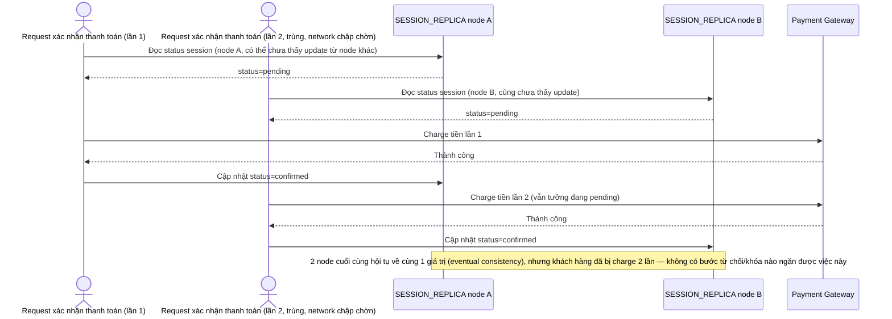

# Base sequence — Confirm payment (dùng chung eventual consistency, double-charge)

Đây là **base**, flow "Xác nhận thanh toán" ở trạng thái hiện tại — dùng cùng cơ chế eventual consistency như mọi API khác, không có khóa hay quorum riêng. Flow này liên quan mật thiết tới enhance vì toàn bộ 5 yêu cầu của đề bài đều nhằm sửa đúng lỗ hổng nguy hiểm này.

