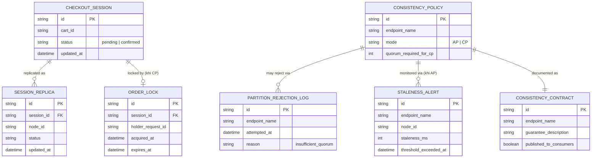

# Enhance ERD — sau khi có tunable consistency theo API

Đây là ERD **sau khi** enhance được áp dụng lên base. So với base, có 4 nhóm entity mới, ứng trực tiếp với 5 yêu cầu trong đề bài:

- `CONSISTENCY_POLICY` (mới) — phân loại rõ endpoint nào AP, endpoint nào CP.
- `ORDER_LOCK` (mới) — khóa CP cho xác nhận thanh toán, đảm bảo chỉ 1 request thắng khi có 2 request trùng.
- `PARTITION_REJECTION_LOG` (mới) — ghi nhận các lần API CP từ chối rõ ràng khi không đủ quorum.
- `STALENESS_ALERT` (mới) — cảnh báo khi độ trễ của API AP vượt ngưỡng bất thường.
- `CONSISTENCY_CONTRACT` (mới) — tài liệu hoá guarantee từng endpoint cho team khác dùng đúng cách.

