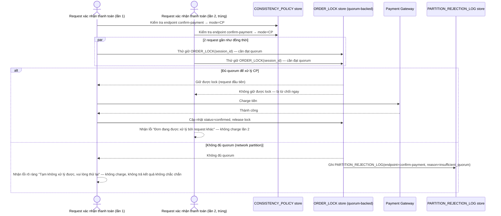

# Enhance sequence — Confirm payment (CP, lock quorum, từ chối rõ ràng khi thiếu quorum)

Đây là **enhance**, cùng flow "Confirm payment" đã có ở base nhưng nay thay đổi hoàn toàn theo yêu cầu 1, 2 và 4 của đề bài: chuyển sang CP với `ORDER_LOCK` cần quorum, chỉ 1 trong 2 request trùng được xác nhận, và từ chối rõ ràng thay vì âm thầm trả kết quả sai khi thiếu quorum.

