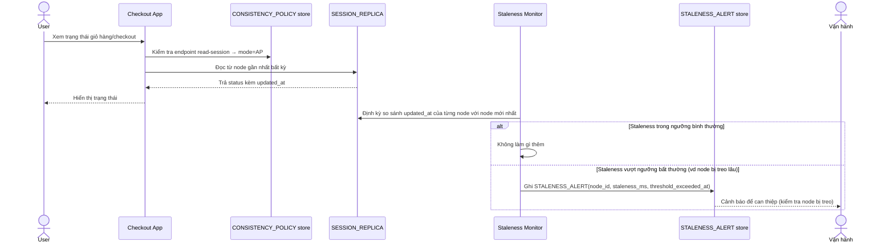

# Enhance sequence — Read session (AP, cảnh báo staleness bất thường)

Đây là **enhance**, cùng flow "Read session" đã có ở base nhưng nay thay đổi theo yêu cầu thứ 3 của đề bài: vẫn giữ AP cho tốc độ, nhưng thêm phát hiện và cảnh báo khi staleness vượt ngưỡng bất thường (vd 1 node bị treo lâu).

