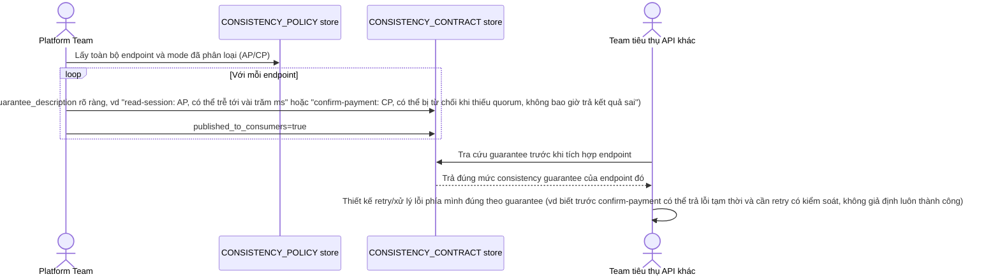

# Enhance sequence — Consistency contract publishing

Đây là **enhance**, flow hoàn toàn mới, phát sinh từ enhance — chưa tồn tại ở base (base không tài liệu hoá gì về consistency). Đáp ứng yêu cầu thứ 5 của đề bài: viết rõ và công bố mức consistency guarantee của từng endpoint để team khác (API consumer) dùng đúng cách, tránh giả định sai.

