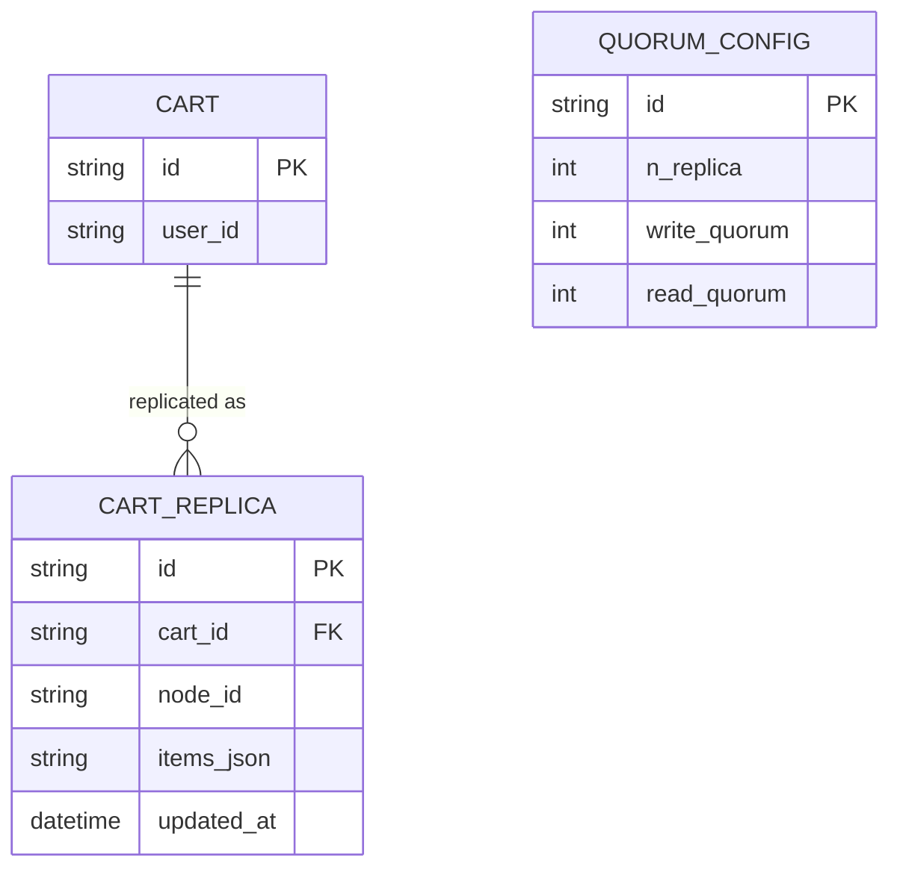

# Base ERD — Giỏ hàng KV store trước khi có tunable consistency rõ ràng

Đây là **base**: mô hình dữ liệu suy luận từ ngữ cảnh đề bài, thể hiện trạng thái hệ thống **trước khi** có cấu hình quorum tường minh và chiến lược merge. Đề bài nói giỏ hàng lưu trên KV store nhiều replica kiểu DynamoDB/Cassandra — nên base cần đủ: giỏ hàng, replica của nó trên từng node, và 1 cấu hình quorum (N, W, R) duy nhất chưa được lý giải rõ có thoả W+R>N hay không. Chưa có entity nào phục vụ merge/conflict log/mức consistency theo use case — những thứ đó là phần enhance.

