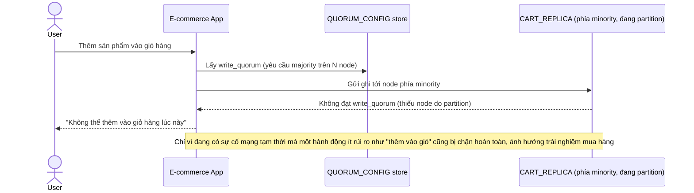

# Base sequence — Add to cart (W yêu cầu majority, mất availability lúc partition)

Đây là **base**, flow "Thêm sản phẩm vào giỏ hàng" ở trạng thái hiện tại — write_quorum yêu cầu đạt majority, nên phía minority bị từ chối hoàn toàn khi có partition. Flow này liên quan mật thiết tới enhance vì yêu cầu thứ 2 của đề bài chính là đổi lại ưu tiên ở đây.

