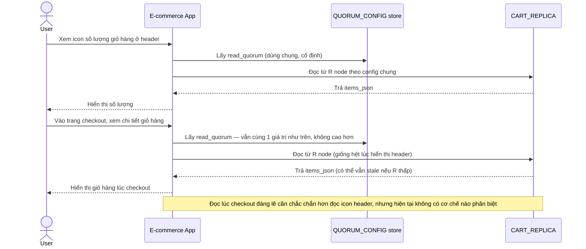

# Base sequence — Read cart (cùng 1 read_quorum cho mọi use case)

Đây là **base**, flow "Đọc giỏ hàng" — dùng chung đúng 1 read_quorum cho mọi mục đích, từ hiển thị icon số lượng ở header tới đọc lúc checkout. Flow này liên quan mật thiết tới enhance vì yêu cầu thứ 4 của đề bài chính là cho phép phân biệt mức consistency theo tình huống.

