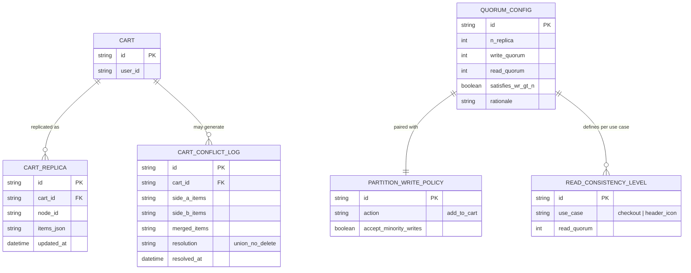

# Enhance ERD — sau khi có tunable consistency và merge rõ ràng

Đây là ERD **sau khi** enhance được áp dụng lên base. So với base, có 4 nhóm entity mới, ứng trực tiếp với 5 yêu cầu trong đề bài:

- `QUORUM_CONFIG` thêm `satisfies_wr_gt_n`/`rationale` — lý giải rõ tại sao chọn W+R>N hay không.
- `PARTITION_WRITE_POLICY` (mới) — ưu tiên availability cho "thêm vào giỏ", chấp nhận ghi phía minority.
- `CART_CONFLICT_LOG` (mới) — chiến lược merge union khi partition hàn lại, đồng thời đo tần suất conflict.
- `READ_CONSISTENCY_LEVEL` (mới) — client chọn mức consistency theo use case (checkout vs header icon).

