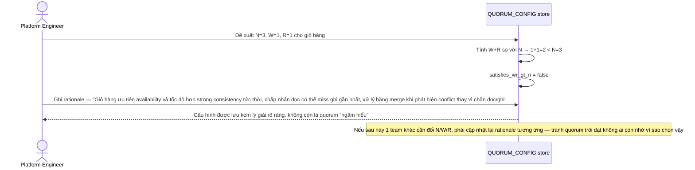

# Enhance sequence — Configure quorum (định nghĩa N, W, R có lý giải)

Đây là **enhance**, flow hoàn toàn mới, phát sinh từ enhance — chưa tồn tại ở base (base có cấu hình quorum nhưng không lý giải). Đáp ứng yêu cầu thứ 1 của đề bài: định nghĩa cụ thể N, W, R cho giỏ hàng và giải thích rõ có chọn W+R>N hay không.

