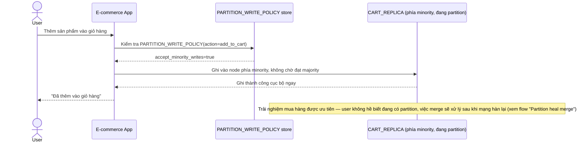

# Enhance sequence — Add to cart (ưu tiên availability, chấp nhận ghi minority)

Đây là **enhance**, cùng flow "Add to cart" đã có ở base nhưng nay thay đổi hoàn toàn theo yêu cầu thứ 2 của đề bài: chấp nhận ghi ở phía minority lúc partition, merge để sau, thay vì từ chối như base.

