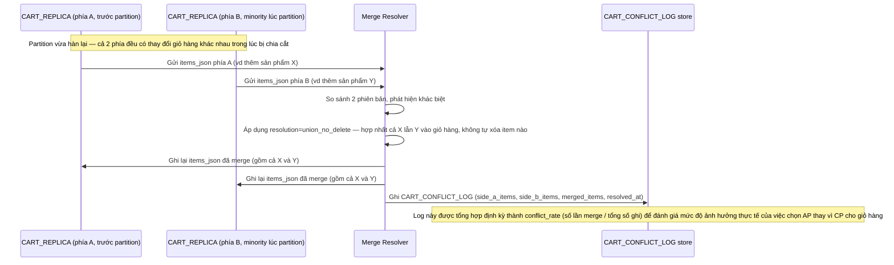

# Enhance sequence — Partition heal merge

Đây là **enhance**, flow hoàn toàn mới, phát sinh từ enhance — chưa tồn tại ở base (base không cho phép ghi phía minority nên chưa từng có gì để merge). Đáp ứng yêu cầu 3 và 5 của đề bài: merge union khi 2 phía cùng sửa giỏ hàng khác nhau, không tự xóa item của bên nào, và đo tần suất conflict xảy ra thực tế.

