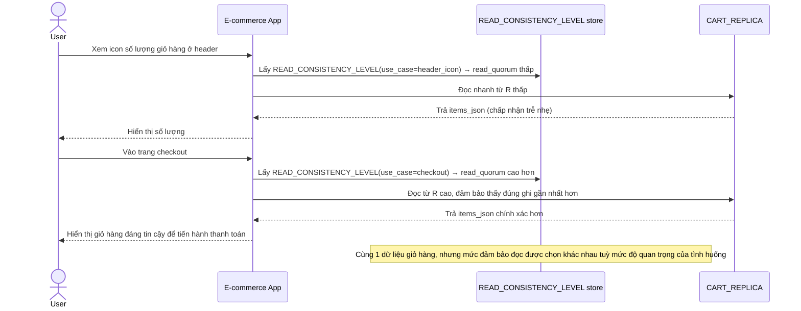

# Enhance sequence — Read cart (chọn mức consistency theo use case)

Đây là **enhance**, cùng flow "Read cart" đã có ở base nhưng nay thay đổi theo yêu cầu thứ 4 của đề bài: client chọn read quorum khác nhau theo tình huống — R thấp cho icon header, R cao hơn cho checkout.

