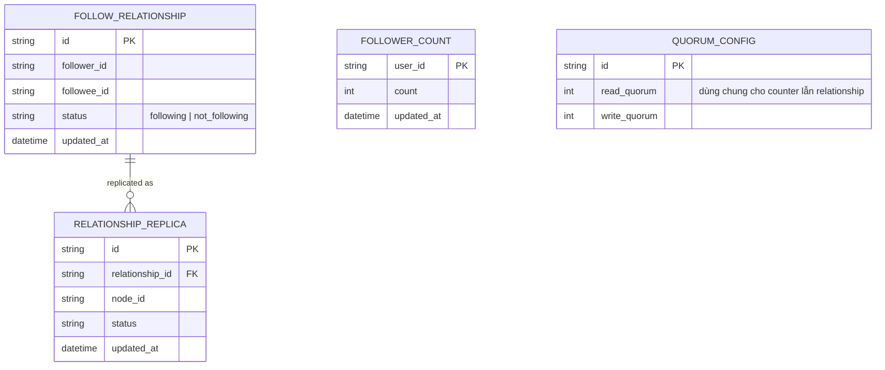

# Base ERD — Follow/follower trước khi tách consistency riêng cho counter

Đây là **base**: mô hình dữ liệu suy luận từ ngữ cảnh đề bài, thể hiện trạng thái hệ thống **trước khi** tách riêng consistency cho counter và cho quan hệ follow. Đề bài nói follower count hiển thị trên profile và quan hệ follow/unfollow là 2 khái niệm khác nhau — nên base cần đủ: quan hệ follow (kèm replica), và bộ đếm follower cập nhật trực tiếp theo từng lần follow/unfollow, tất cả dùng chung 1 cấu hình quorum. Chưa có entity nào phục vụ version/ordering, partition policy riêng cho follow, counter bất đồng bộ, hay đối soát — những thứ đó là phần enhance.

