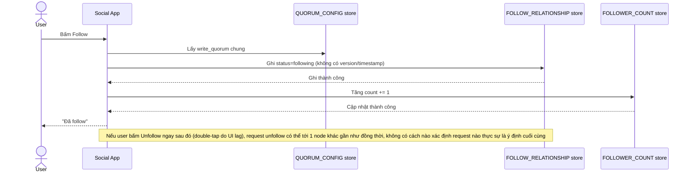

# Base sequence — Follow/unfollow (ghi trực tiếp, không version)

Đây là **base**, flow "Follow/unfollow" ở trạng thái hiện tại — ghi quan hệ và cập nhật counter trực tiếp, dùng cùng quorum cố định, không có version/timestamp để xử lý thứ tự. Flow này liên quan mật thiết tới enhance vì yêu cầu 2 và 3 của đề bài chính là sửa đúng lỗ hổng ở đây.

