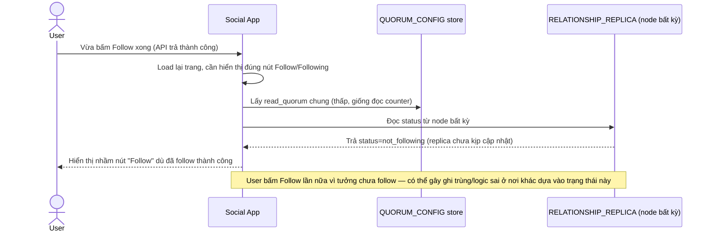

# Base sequence — Check following status (đọc cùng R thấp, có thể sai nút bấm)

Đây là **base**, flow "Kiểm tra đã follow chưa để hiển thị nút Follow/Following" — dùng cùng read_quorum thấp như đọc counter, có thể đọc phải replica trễ. Flow này liên quan mật thiết tới enhance vì yêu cầu thứ 2 của đề bài chính là sửa đúng lỗ hổng này.

