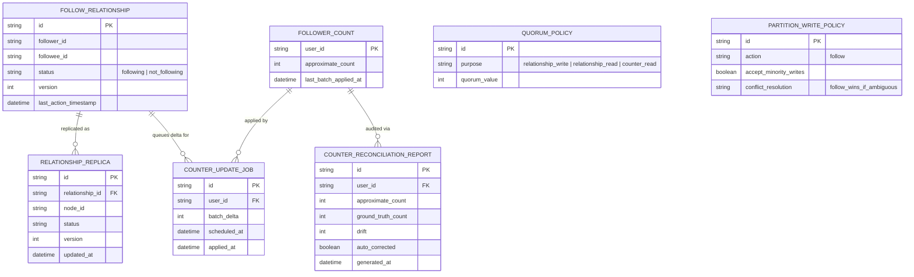

# Enhance ERD — sau khi tách consistency counter/relationship

Đây là ERD **sau khi** enhance được áp dụng lên base. So với base, có 4 nhóm thay đổi chính, ứng trực tiếp với 5 yêu cầu trong đề bài:

- `QUORUM_POLICY` (mới) — tách riêng quorum theo mục đích: relationship write/read dùng quorum cao, counter read dùng quorum thấp.
- `FOLLOW_RELATIONSHIP` thêm `version`/`last_action_timestamp` — xử lý đúng thứ tự khi follow/unfollow gần như đồng thời.
- `PARTITION_WRITE_POLICY` (mới) — ưu tiên availability cho follow lúc partition, merge theo "follow thắng nếu không xác định được".
- `FOLLOWER_COUNT` chuyển sang cập nhật bất đồng bộ qua `COUNTER_UPDATE_JOB`; `COUNTER_RECONCILIATION_REPORT` (mới) — đối soát định kỳ với ground truth và tự điều chỉnh khi lệch vượt ngưỡng.

