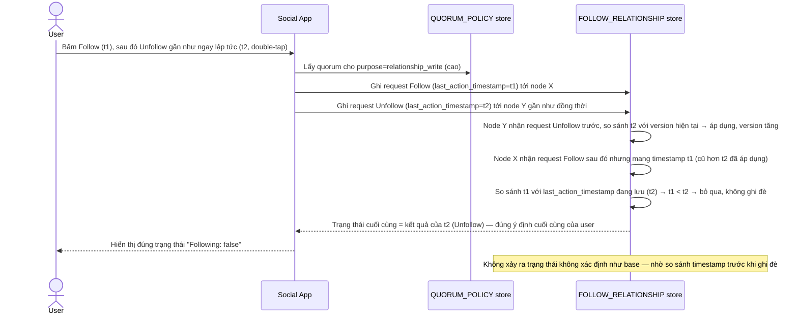

# Enhance sequence — Follow/unfollow (write quorum cao, version để xử lý race)

Đây là **enhance**, cùng flow "Follow/unfollow" đã có ở base nhưng nay thay đổi theo yêu cầu 2 và 3 của đề bài: ghi với write quorum cao hơn, và dùng version/timestamp để xác định đúng ý định cuối khi có 2 request follow/unfollow gần như đồng thời.

