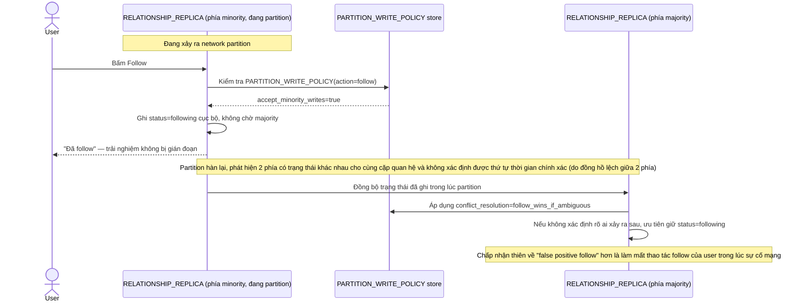

# Enhance sequence — Follow during partition

Đây là **enhance**, flow hoàn toàn mới, phát sinh từ enhance — chưa tồn tại ở base (base không có quyết định rõ ràng cho partition). Đáp ứng yêu cầu thứ 4 của đề bài: ưu tiên availability cho hành động follow, chấp nhận ghi phía minority, merge theo "follow thắng nếu trùng thời điểm không xác định được" khi partition hàn lại.

