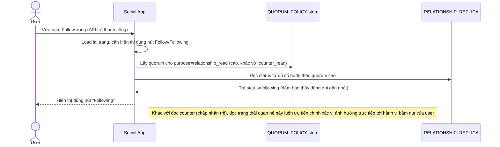

# Enhance sequence — Check following status (read quorum cao riêng cho relationship)

Đây là **enhance**, cùng flow "Check following status" đã có ở base nhưng nay thay đổi theo yêu cầu thứ 2 của đề bài: dùng `QUORUM_POLICY(purpose=relationship_read)` riêng với quorum cao, đảm bảo đọc đúng ngay sau khi follow thành công.

