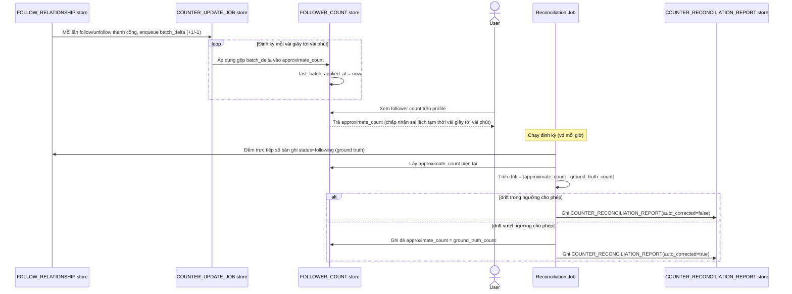

# Enhance sequence — Approximate counter update & reconciliation

Đây là **enhance**, flow hoàn toàn mới, phát sinh từ enhance — chưa tồn tại ở base (base cập nhật counter đồng bộ trực tiếp). Đáp ứng yêu cầu 1 và 5 của đề bài: counter hiển thị cập nhật bất đồng bộ theo batch, chấp nhận sai lệch tạm thời, và có đối soát định kỳ với ground truth để tự điều chỉnh khi lệch vượt ngưỡng.

