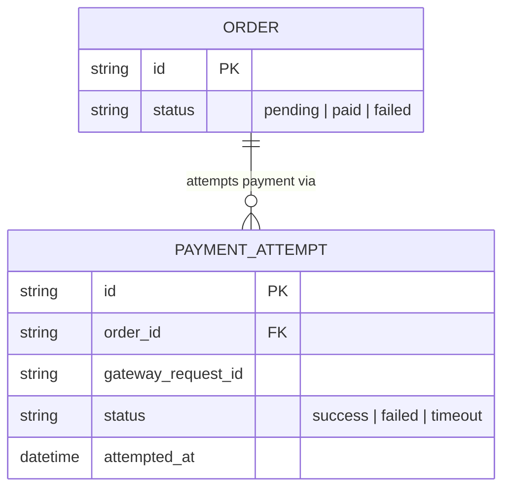

# Base ERD — Checkout gọi payment gateway trước khi có circuit breaker

Đây là **base**: mô hình dữ liệu suy luận từ ngữ cảnh đề bài, thể hiện trạng thái hệ thống **trước khi** có circuit breaker + retry an toàn. Đề bài nói checkout gọi trực tiếp API cổng thanh toán bên ngoài — nên base cần đủ: đơn hàng và các lần gọi thanh toán, ghi nhận đơn giản không phân loại lỗi. Chưa có entity nào phục vụ circuit breaker state/idempotency key/retry policy/metric — những thứ đó là phần enhance.

