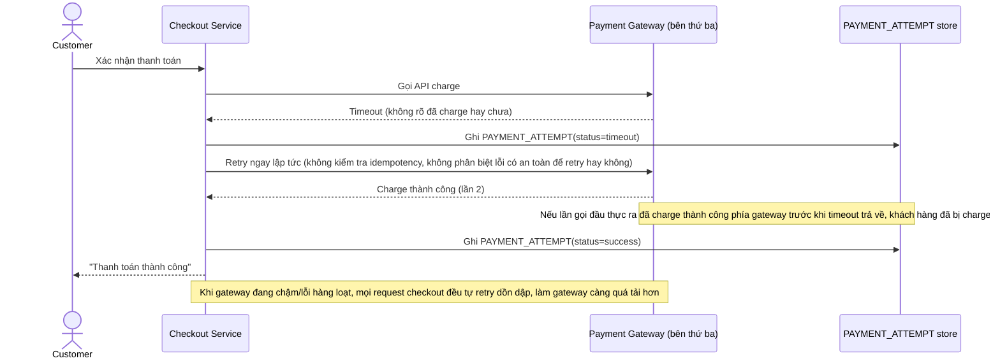

# Base sequence — Checkout payment (gọi trực tiếp, retry mù quáng)

Đây là **base**, flow "Thanh toán lúc checkout" ở trạng thái hiện tại — gọi thẳng gateway, retry ngay lập tức không phân biệt loại lỗi, không kiểm tra idempotency. Flow này liên quan mật thiết tới enhance vì toàn bộ 5 yêu cầu của đề bài đều nhằm sửa đúng các lỗ hổng ở đây.

