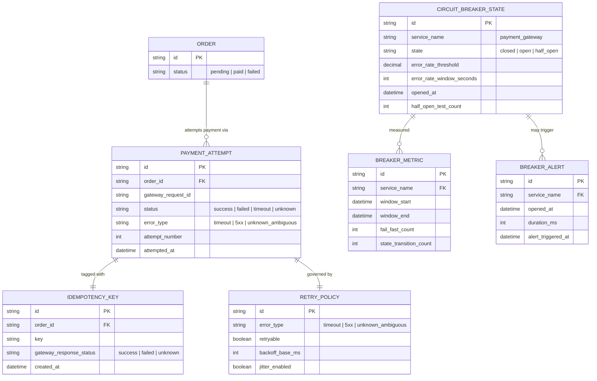

# Enhance ERD — sau khi có circuit breaker + retry an toàn

Đây là ERD **sau khi** enhance được áp dụng lên base. So với base, có 4 nhóm entity mới, ứng trực tiếp với 5 yêu cầu trong đề bài:

- `CIRCUIT_BREAKER_STATE` (mới) — trạng thái closed/open/half_open, ngưỡng mở, thời điểm mở.
- `IDEMPOTENCY_KEY` (mới) — gắn với mỗi lần charge, dùng để kiểm tra trước khi quyết định retry cho lỗi không rõ kết quả.
- `RETRY_POLICY` (mới) — phân loại rõ lỗi nào được retry, backoff exponential kèm jitter.
- `BREAKER_METRIC` + `BREAKER_ALERT` (mới) — đo tỉ lệ fail-fast, số lần chuyển trạng thái, cảnh báo khi breaker mở quá lâu.

