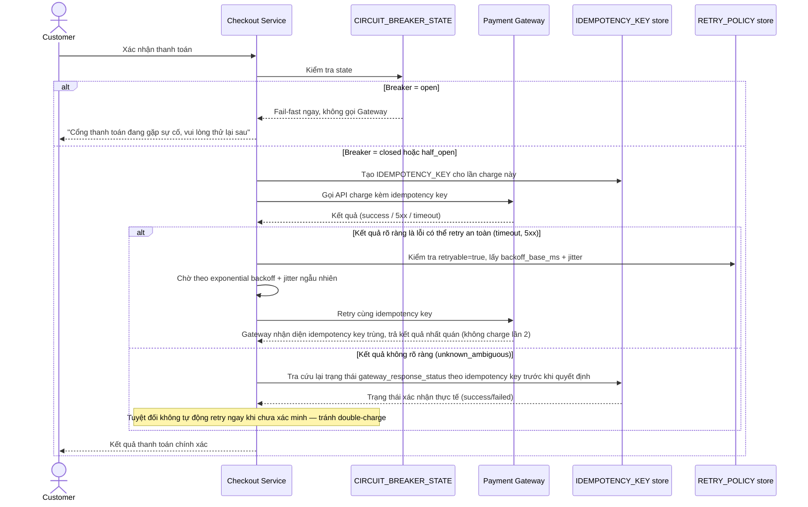

# Enhance sequence — Checkout payment (qua circuit breaker, retry an toàn)

Đây là **enhance**, cùng flow "Checkout payment" đã có ở base nhưng nay thay đổi hoàn toàn theo yêu cầu 1, 2 và 3 của đề bài: gọi qua circuit breaker, chỉ retry lỗi an toàn với exponential backoff kèm jitter, và kiểm tra idempotency trước khi retry lỗi không rõ kết quả.

