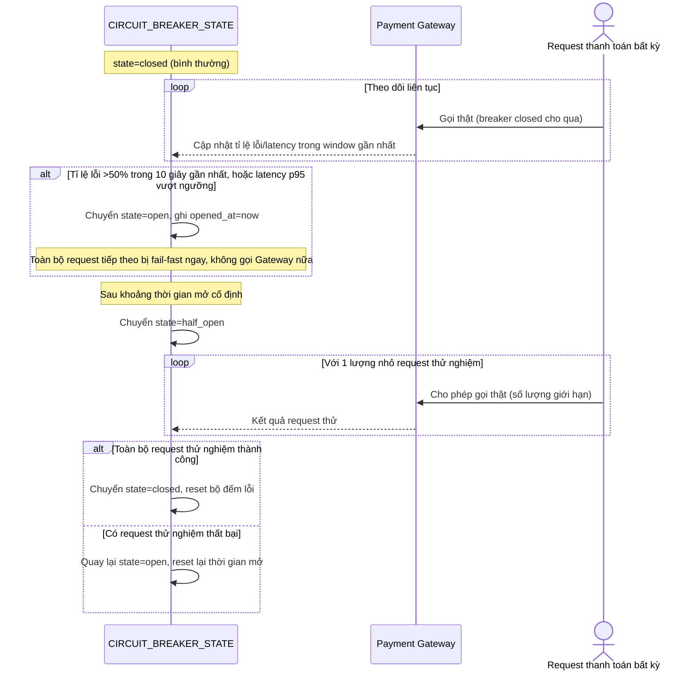

# Enhance sequence — Circuit breaker state machine

Đây là **enhance**, flow hoàn toàn mới, phát sinh từ enhance — chưa tồn tại ở base (base không có khái niệm breaker). Đáp ứng yêu cầu 1 và 4 của đề bài: ngưỡng mở rõ ràng, hành vi fail-fast khi mở, và trạng thái half-open thử lại một lượng nhỏ request trước khi đóng hẳn.

